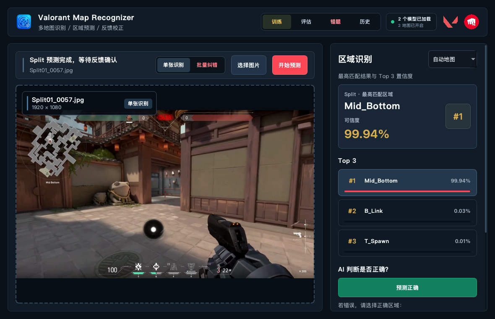
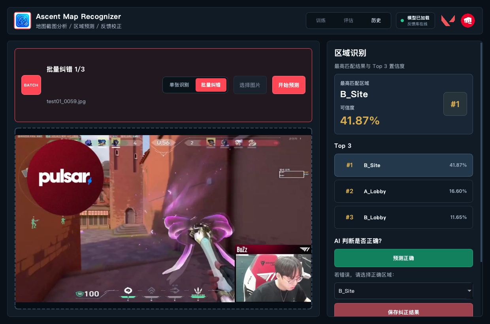
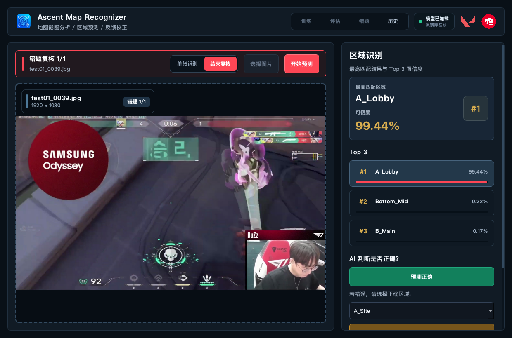
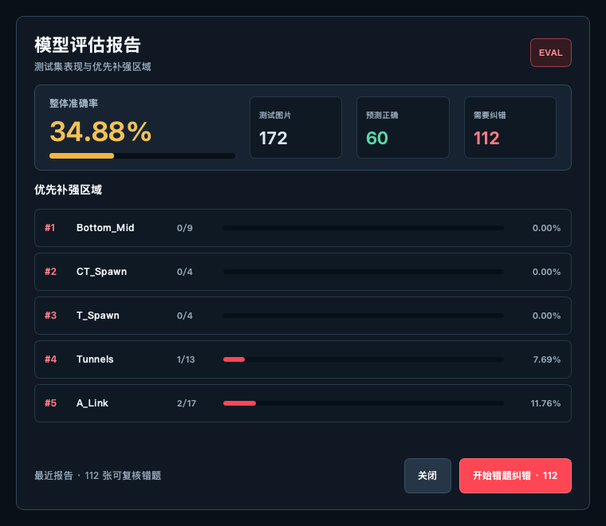

# GameSceneDesk

## 快速参考 / Quick Reference

| 版本 / Edition | 面向对象 / Audience | 功能 / Features | 交付方式 / Delivery |
|---|---|---|---|
| Public Tester / 公开测试版 | 外部测试者 / External testers | 地图与区域识别、Top 3 结果、正确/纠错/无关反馈、历史与反馈 ZIP 导出；不含训练和评估 / Map and area recognition, Top 3 results, feedback, history, and feedback ZIP export; no training or evaluation | macOS/Windows 独立应用包 / Standalone macOS/Windows packages |
| Developer / Trainer / 开发训练版 | 项目维护者 / Maintainer | Public Tester 的全部功能，加上训练、评估与错题复核 / Everything in Public Tester plus training, evaluation, and wrong-case review | 源码、完整依赖和私有数据集；不作为公开安装包发布 / Source, full dependencies, and private datasets; not distributed as a public package |

### 安装包状态 / Package availability

| 平台 / Platform | 当前状态 / Current status | 获取方式 / How to get it |
|---|---|---|
| macOS 15+ Apple Silicon | 已在本机生成并验证独立 `.app`；当前为 ad-hoc 签名且尚未公证 / A standalone `.app` has been built and verified locally; it is ad-hoc signed and not notarized | 本地输出：`dist/macos/Ascent-Map-Recognizer-Public-Tester-v1.0.0-macOS-arm64.zip`；也可运行 `zsh build_macos.sh` 重新构建 / Local output: `dist/macos/Ascent-Map-Recognizer-Public-Tester-v1.0.0-macOS-arm64.zip`; rebuild with `zsh build_macos.sh` |
| Windows 10/11 x64 | 尚无已构建、已验证的 Windows `.exe`；当前只有构建脚本 / No built and verified Windows `.exe` yet; build scripts only | 必须在 Windows PowerShell 中运行 `.\build_windows.ps1` / Run `.\build_windows.ps1` in Windows PowerShell |

> GitHub Releases 当前没有可下载附件，仓库中的构建脚本也不是成品安装包。完整步骤见 [构建说明 / Build guide](BUILDING.md)。
> There are currently no downloadable GitHub Release assets, and the build scripts in this repository are not packaged applications. See the [build guide](BUILDING.md) for complete instructions.

## 界面预览 / Screenshots

### 多地图区域识别 / Multi-map Recognition



| 批量纠错 / Batch Correction | 错题回顾（开发训练版） / Wrong-case Review (Developer / Trainer) |
|:---:|:---:|
|  |  |

### 模型评估（开发训练版） / Model Evaluation (Developer / Trainer)

<p align="center">
  
</p>

---

## 中文介绍

GameSceneDesk 是一个面向《VALORANT》游戏截图的实验性 AI 桌面应用。导入或拖放截图后，应用可以自动判断地图，并预测画面所在的具体区域，同时展示 Top 3 匹配结果与置信度，帮助玩家整理素材、分析场景，也为游戏视觉识别模型的训练与研究提供一个直观的工作台。

目前项目支持 **Ascent** 和 **Split**。Public Tester 提供单张识别、批量纠错、无关图片过滤、反馈历史与脱敏反馈包导出；推理完全在本地完成。Developer / Trainer 从源码运行，额外开放训练、评估与错题复核。训练工具和私有数据不会打进公开测试版桌面应用。

### 主要功能

- 自动识别地图，或手动指定地图
- 预测截图中的具体区域并展示 Top 3 结果
- 过滤与目标地图无关的图片
- 支持拖放图片、单张识别和批量纠错
- 记录正确、错误与无关样本，形成反馈闭环
- 从“历史”导出移除本机路径和原文件名的反馈 ZIP，手动发送给项目维护者；截图内容仍会保留
- macOS 与 Windows 使用同一套识别代码和模型
- 训练与评估工具作为开发脚本保留，不进入发行界面
- 当前支持 Ascent 与 Split，结构可继续扩展至更多地图

### 项目状态

本项目仍处于实验和持续训练阶段，识别效果会受到截图视角、画质、界面遮挡及训练数据规模的影响。它更适合作为计算机视觉学习、数据整理和模型迭代项目，而不是准确率已经稳定的成品工具。

### 运行源码

```bash
python -m venv .venv
source .venv/bin/activate  # Windows PowerShell: .\.venv\Scripts\Activate.ps1
python -m pip install -r requirements.txt
python app.py
```

从源码运行会进入 Developer / Trainer，训练工具可用；训练仍需要本地私有数据集。仓库包含运行所需的 Ascent、Split 模型，但不包含训练数据集、评估输出、虚拟环境或构建产物。

### 构建桌面应用

- macOS 15+ Apple Silicon：`zsh build_macos.sh`
- Windows 10/11 x64：在 PowerShell 中运行 `.\build_windows.ps1`

两个系统必须分别构建。macOS 输出 `.app`，Windows 输出包含 `.exe` 与 `_internal` 的完整目录。详细步骤见 [BUILDING.md](BUILDING.md)。

---

## English

GameSceneDesk is an experimental AI desktop application that recognizes maps and in-game locations from VALORANT screenshots. Import or drag in an image, and the app can automatically identify the map, predict the visible area, and display the top three matches with confidence scores. It serves both as a practical screenshot-analysis workspace and as an approachable platform for training and evaluating game-scene recognition models.

The project currently supports **Ascent** and **Split**. Public Tester builds include single-image prediction, batch correction, irrelevant-image filtering, feedback history, and sanitized feedback-bundle export. Developer / Trainer runs from source and additionally exposes training, evaluation, and wrong-case review. Training tools and private datasets are not bundled into the public desktop app.

### Highlights

- Automatic map detection or manual map selection
- In-game location prediction with top-three confidence scores
- Filtering for images unrelated to the selected map
- Drag-and-drop input, single-image mode, and batch correction
- Feedback collection for correct, incorrect, and irrelevant samples
- Feedback ZIP export from History with local paths and original filenames removed; screenshot content is retained
- Shared recognition code and models across macOS and Windows
- Developer training and evaluation scripts kept outside release builds
- Initial support for Ascent and Split, with an extensible multi-map design

### Project Status

This project is still experimental and under active model iteration. Accuracy varies with camera angle, image quality, UI obstruction, and the amount of training data. It is best viewed as a computer-vision learning, dataset-management, and model-development project rather than a production-ready recognition system.

### Run from source

```bash
python -m venv .venv
source .venv/bin/activate  # Windows PowerShell: .\.venv\Scripts\Activate.ps1
python -m pip install -r requirements.txt
python app.py
```

Source runs use the Developer / Trainer edition and expose the model tools; training still requires the maintainer's private local datasets. The repository includes the runtime Ascent and Split models. Training datasets, evaluation output, virtual environments, and packaged applications are intentionally excluded.

### Build desktop apps

- macOS 15+ on Apple Silicon: `zsh build_macos.sh`
- Windows 10/11 x64: run `.\build_windows.ps1` in PowerShell

Each operating system must build its own package. See [BUILDING.md](BUILDING.md) for complete instructions.

---

## Tech Stack

- Python
- PySide6 / Qt
- PyTorch and TorchVision
- MobileNetV3
- OpenCV and Pillow

## Disclaimer

GameSceneDesk is an independent, community-made project and is not affiliated with or endorsed by Riot Games. VALORANT and all related trademarks belong to their respective owners.
